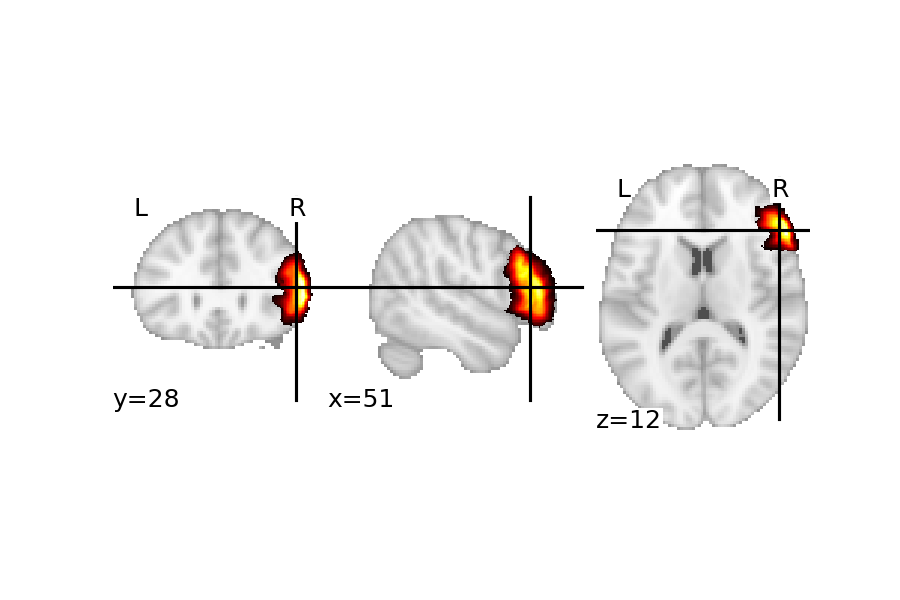
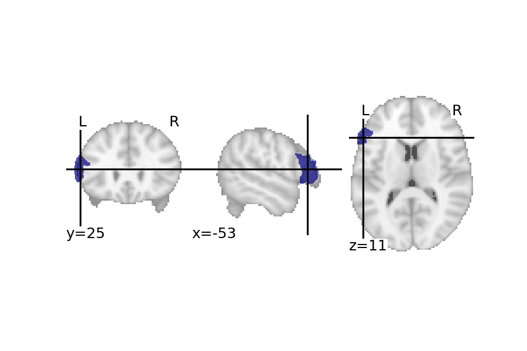
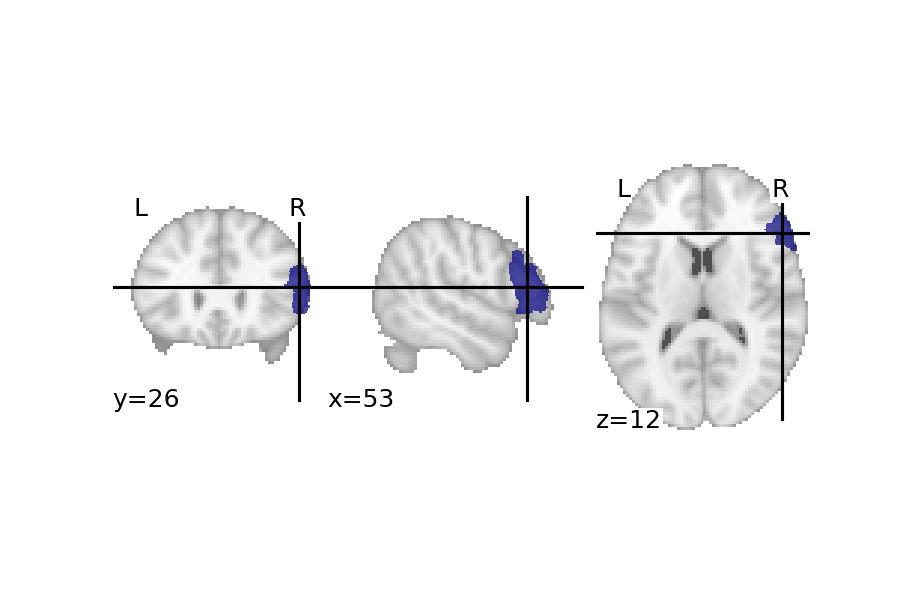

# Area 45 (IFG)

```
Julich-Brain Cytoarchitectonic Maps 2.9
└── telencephalon
    └── cerebral cortex
        └── frontal lobe
            └── inferior frontal gyrus
```

### Probability maps

{ width="50%" } { width="50%" }
Download:

- [Area 45 (IFG) left](https://neuroglancer.humanbrainproject.eu/precomputed/data-repo-ng-bot/20210616-julichbrain-v2.9.0-complete-mpm/PMs/Area-45/9.2/Area-45_l_N10_nlin2ICBM152asym2009c_9.2_publicP_23d2ee784534e0080f62cba69c188581.nii.gz)
- [Area 45 (IFG) right](https://neuroglancer.humanbrainproject.eu/precomputed/data-repo-ng-bot/20210616-julichbrain-v2.9.0-complete-mpm/PMs/Area-45/9.2/Area-45_r_N10_nlin2ICBM152asym2009c_9.2_publicP_c730bc71c8e8fdd4620a649c38bc3594.nii.gz)


### Maximum probability maps

{ width="50%" } { width="50%" }

### Description

This dataset contains the distinct architectonic Area 45 (IFG) in the individual, single subject template of the MNI Colin 27 as well as the MNI ICBM 152 2009c nonlinear asymmetric reference space. As part of the Julich-Brain cytoarchitectonic atlas, the area was identified using cytoarchitectonic analysis on cell-body-stained histological sections of 10 human postmortem brains obtained from the body donor program of the University of Düsseldorf. The results of the cytoarchitectonic analysis were then mapped to both reference spaces, where each voxel was assigned the probability to belong to Area 45 (IFG). The probability map of Area 45 (IFG) are provided in the NifTi format for each brain reference space and hemisphere. The Julich-Brain atlas relies on a modular, flexible and adaptive framework containing workflows to create the probabilistic brain maps for these structures. Note that methodological improvements and integration of new brain structures may lead to small deviations in earlier released datasets.

Other available data versions of Area 45 (IFG):
Amunts et al. (2018) [Data set, v7.2] [DOI: 10.25493/J2KZ-AZW](https://doi.org/10.25493%2FJ2KZ-AZW)

The most probable delineation of Area 45 (IFG) derived from the calculation of a maximum probability map of all currently released Julich-Brain brain structures can be found here:
Amunts et al. (2019) [Data set, v1.13] [DOI: 10.25493/Q3ZS-NV6](https://doi.org/10.25493%2FQ3ZS-NV6)
Amunts et al. (2019) [Data set, v1.18] [DOI: 10.25493/8EGG-ZAR](https://doi.org/10.25493%2F8EGG-ZAR)
Amunts et al. (2020) [Data set, v2.2] [DOI: 10.25493/TAKY-64D](https://doi.org/10.25493%2FTAKY-64D)

### Publications

Amunts, K., Weiss, P. H., Mohlberg, H., Pieperhoff, P., Eickhoff, S., Gurd, J. M., … Zilles, K. (2004). Analysis of neural mechanisms underlying verbal fluency in cytoarchitectonically defined stereotaxic space—The roles of Brodmann areas 44 and 45. NeuroImage, 22(1), 42–56. 
Amunts, K., Schleicher, A., Bürgel, U., Mohlberg, H., Uylings, H. B. M., & Zilles, K. (1999). Broca’s region revisited: Cytoarchitecture and intersubject variability. The Journal of Comparative Neurology, 412(2), 319–341. 

